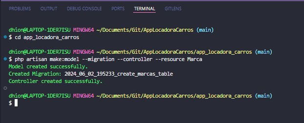
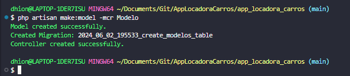
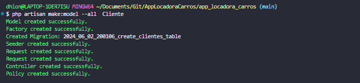
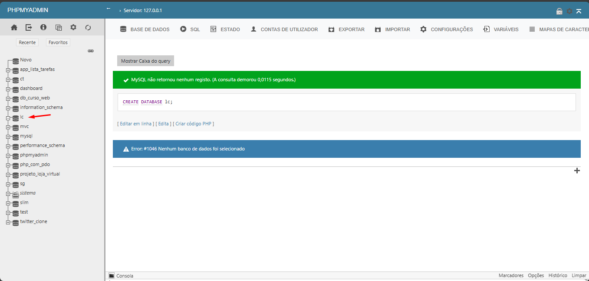
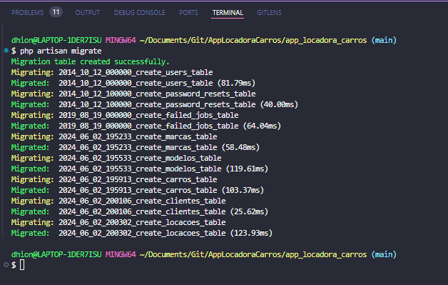
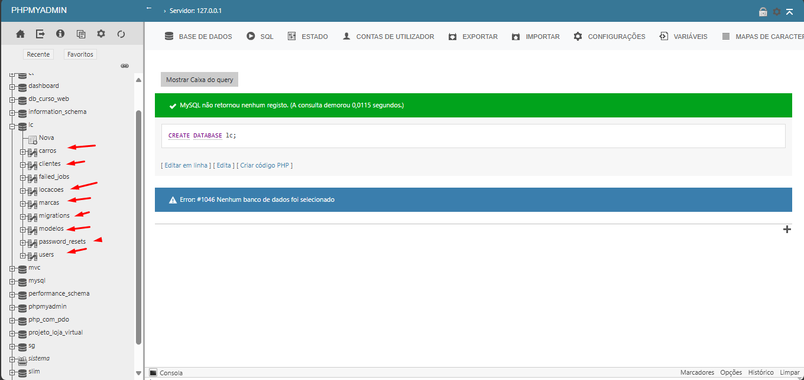
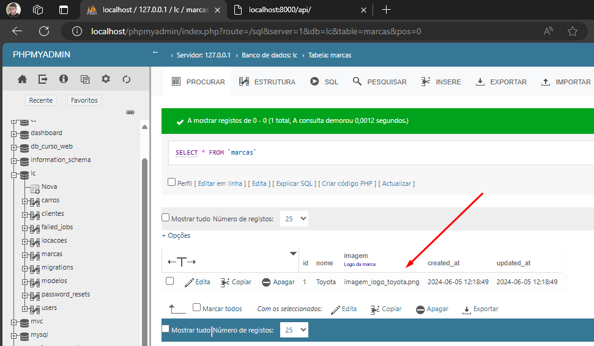

Criando model controller e migration de marca:
`php artisan make:model --migration --controller --resource Marca`

Criando model controller e migration de modelo:
`php artisan make:model -mcr Modelo`

Criando o model, factory, migration, seeder, controller de Carro com uma unica instrução:
`$ php artisan make:model --all  Carro`

Criando o model, factory, migration, seeder, controller de Cliente com uma unica instrução:
`$ php artisan make:model --all  Cliente`

Criando o model, factory, migration, seeder, controller de Cliente com uma unica instrução:
`$ php artisan make:model -a  Locacao`

* Criando banco de dados:
`CREATE DATABASE lc; `

*Definindo banco lc no .env*
* Executando as migrates:
`php artisan migrate`

* Fazendo um post com o Postman para api:

teste git