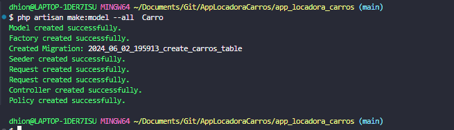
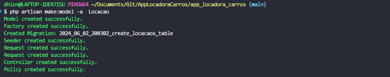

Criando model controller e migration de marca:
`php artisan make:model --migration --controller --resource Marca`

Criando model controller e migration de modelo:
`php artisan make:model -mcr Modelo`

Criando o model, factory, migration, seeder, controller de Carro com uma unica instrução:
`$ php artisan make:model --all  Carro`

Criando o model, factory, migration, seeder, controller de Cliente com uma unica instrução:
`$ php artisan make:model --all  Cliente`

Criando o model, factory, migration, seeder, controller de Cliente com uma unica instrução:
`$ php artisan make:model -a  Locacao`

* Criando banco de dados:
`CREATE DATABASE lc; `

*Definindo banco lc no .env*
* Executando as migrates:
`php artisan migrate`

* Fazendo um post com o Postman para api:

* Tratando o método stateless de redirect do validate do laravel, para quando for api,retornar um json e não um redirect:
* É necessário nos headers informar que o client aceita uma requisição json

  
  * Enviando arquivos pelo postman e fazendo a leitura pela API:
  
* Salvando imagens no diretório storange:

* Criando um link simbólico para acessar as imagens no diretório público:
*``
* 
* 
* Atualizando imagens da marca:

* Criando controller para Autenticação JWT
`php artisan make:controller AuthController`

* Criando um usuário pelo tinker

* Passando jwt nos headers como authorization:

* Recuperando dados do usuario logado com JWT

* Definindo variável global JWT_TTL para 120 para que a o token jwt dure 120 minutos  e não 60 que pe o valor padrão

Instalando laravel ui para começar a trabalhar com vueJs
`php composer.phar laravel/ui:^3.2.1`

Intalando o vueJs com autenticação nativa do laravel:
`$ php artisan ui vue --auth`

Fazendo a instação dos pacotes:
`npm install`

Fazendo o build das views
`npm run dev`

instalando o vue loader:
`npm install vue-loader@^15.9.8 --save-dev --legacy-peer-deps`

instalando o pacote vueX no projeto:
`npm install vuex@3.6.2`
