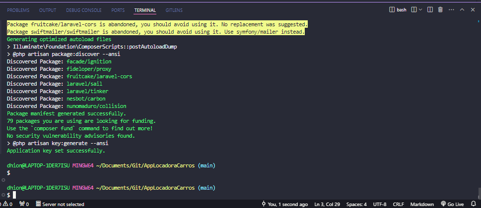
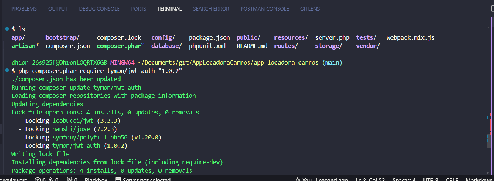

# AppLocadoraCarros
Criando um app Rest com Laravel 
Iniciando o app com laravel:
`composer create-project --prefer-dist laravel/laravel app_locadora_carros "8.5.9"`

* Instalando JWT auth
`$ php composer.phar require tymon/jwt-auth "1.0.2"`
